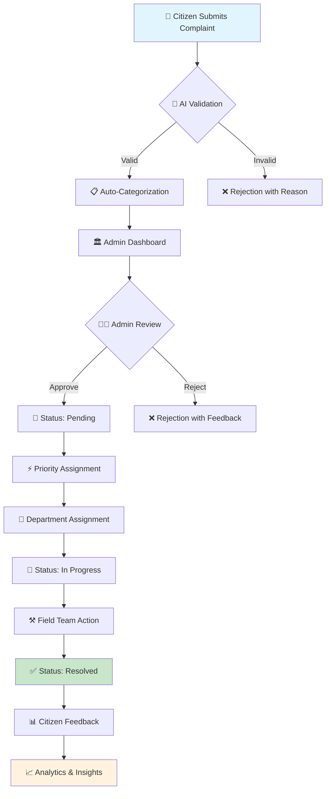
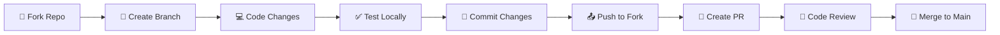

<a name="top"></a>
# 🏛️ NagarVikas
### *Empowering Citizens, Transforming Communities Through Digital Governance*

<div align="center">

[](https://flutter.dev)
[](https://firebase.google.com)
[](https://dart.dev)
[](https://opensource.org/licenses/MIT)

[](https://github.com/Prateek9876/NagarVikas/stargazers)
[](https://github.com/Prateek9876/NagarVikas/network)
[](https://github.com/Prateek9876/NagarVikas/issues)

**🚀 Revolutionizing civic engagement through smart technology | 📱 Built for India's Digital Future**

[📱 Download App](#-screenshots--demo) • [🚀 Quick Start](#-getting-started) • [🤝 Contribute](#-contributing) • [📖 Docs](#-project-architecture)

</div>

---

## 📋 Table of Contents

<details>
<summary><strong>🔍 Click to expand navigation</strong></summary>

- [🌟 Vision & Mission](#-vision--mission)
- [❓ Problem Statement](#-problem-statement)  
- [💡 Our Solution](#-our-solution)
- [🚀 Key Features](#-key-features)
- [🔄 Complaint Lifecycle](#-complaint-lifecycle)
- [🛠️ Technology Stack](#️-technology-stack)
- [📱 Screenshots & Demo](#-screenshots--demo)
- [⚡ Getting Started](#-getting-started)
- [📊 Project Architecture](#-project-architecture)
- [🤝 Contributing](#-contributing)
- [👨‍💻 Meet the Team](#-meet-the-team)
- [📄 License](#-license)

</details>

---

## 🌟 Vision & Mission

> **"Bridging the digital divide between governance and citizens, one complaint at a time."**

**NagarVikas** is more than just an app—it's a movement toward transparent, accountable, and efficient civic governance. Born from the everyday struggles of Indian citizens dealing with broken infrastructure and bureaucratic inefficiency, we've created a comprehensive digital ecosystem that transforms how communities interact with their local government.

### 🎯 Our Mission
- **Democratize** civic engagement through technology
- **Eliminate** bureaucratic red tape in complaint resolution  
- **Empower** citizens with real-time transparency
- **Enable** data-driven decision making for authorities
- **Foster** stronger community connections

---

## ❓ Problem Statement

### The Civic Crisis India Faces Daily

Every Indian citizen encounters these challenges:

| 🚨 **Critical Issues** | 📊 **Current Reality** |
|------------------------|------------------------|
| 💡 Broken streetlights | No centralized reporting system |
| 🚰 Water supply failures | 6-month average resolution time |
| 🕳️ Drainage blockages | Zero transparency in progress |
| 🐕 Stray animal problems | Manual, paper-based processes |
| 🛣️ Road damage & potholes | No citizen feedback mechanism |
| 📞 **No helpline number** | **Communication black hole** |

### 💔 The Pain Points
- **Citizens feel powerless** - nowhere to report issues effectively
- **Authorities lack visibility** - no centralized complaint management
- **Zero accountability** - complaints disappear into bureaucratic void
- **No progress tracking** - citizens left in the dark
- **Inefficient resource allocation** - authorities can't prioritize effectively

---

## 💡 Our Solution

### 🎯 A Complete Digital Transformation

NagarVikas isn't just another app—it's a comprehensive **civic engagement ecosystem** that creates a seamless bridge between citizens and governance.

#### 🔄 The Revolutionary Process
```
👤 Citizen Reports Issue → 📱 Smart Validation → 🏛️ Admin Dashboard → 
⚡ Real-time Assignment → 👥 Field Team Action → ✅ Resolution & Feedback
```

#### 🌟 What Makes Us Different
- **🤖 AI-Powered** complaint categorization and priority assignment
- **📍 GPS Precision** - exact location mapping for faster resolution
- **📊 Real-time Analytics** - data-driven insights for authorities
- **🔔 Instant Notifications** - complete transparency throughout the process
- **🎤 Voice Integration** - accessibility for all literacy levels
- **💬 Community Building** - fostering neighborhood collaboration

---

## 🚀 Key Features

### 👥 For Citizens - *Your Voice, Amplified*

<div align="center">

| 🎯 **Feature** | 📝 **Description** | 🔥 **Impact** |
|----------------|-------------------|---------------|
| 📝 **Smart Complaint Filing** | Submit with photos, videos, GPS location | 5x faster than traditional methods |
| 📍 **Auto-Location Detection** | Precise GPS tagging with address verification | 100% accuracy in issue location |
| 📱 **Real-time Tracking** | Live status updates from submission to resolution | Complete transparency |
| 🔔 **Smart Notifications** | Instant updates via push notifications & SMS | Zero information gap |
| 🎤 **Voice Complaints** | Voice-to-text powered by AI (Coming Soon) | Accessibility for all |
| 💬 **Community Forum** | Connect with neighbors, discuss local issues | Stronger communities |
| ⭐ **Feedback System** | Rate resolution quality & speed | Continuous improvement |
| 🏆 **Gamification** | Earn points for active civic participation | Increased engagement |

</div>

### 🏛️ For Administrators - *Governance Reimagined*

<div align="center">

| ⚡ **Admin Power** | 🛠️ **Functionality** | 📈 **Benefit** |
|-------------------|---------------------|----------------|
| 📊 **Analytics Dashboard** | Real-time insights, trends, and patterns | Data-driven decisions |
| ⚡ **Instant Management** | One-click status updates and assignments | 10x faster processing |
| 📈 **Performance Metrics** | Track resolution rates, response times | Measurable accountability |
| 🎯 **Smart Prioritization** | AI-powered urgent issue identification | Optimal resource allocation |
| 👥 **Team Collaboration** | Department-wise assignment and tracking | Streamlined workflow |
| 📱 **Mobile Command Center** | Full admin access on mobile devices | Management anywhere, anytime |
| 🔍 **Advanced Filtering** | Search, sort, and categorize complaints | Efficient issue management |
| 📊 **Reporting Suite** | Generate detailed reports for stakeholders | Complete accountability |

</div>

---

## 🔄 Complaint Lifecycle

### ⚡ From Problem to Resolution in Record Time



### 📊 Status Definitions

| Status | 📱 Citizen View | 🏛️ Admin Action | ⏱️ SLA |
|--------|----------------|------------------|---------|
| **Submitted** | "Your complaint is received" | Auto-validation in progress | 2 hours |
| **Pending** | "Under admin review" | Priority & department assignment | 24 hours |
| **In Progress** | "Team is working on it" | Field team executing solution | 7 days |
| **Resolved** | "Issue fixed! Rate our service" | Awaiting citizen feedback | - |

---

## 🛠️ Technology Stack

### 🏗️ Architecture Built for Scale

<div align="center">

| 🎨 **Frontend** | ⚙️ **Backend** | ☁️ **Cloud & Storage** | 🔧 **Integrations** |
|-----------------|----------------|------------------------|---------------------|
|  |  |  |  |
|  |  |  |  |

</div>

### 🚀 Why These Technologies?

#### **Frontend Excellence**
- **Flutter** - Single codebase, native performance across iOS, Android, and Web
- **Dart** - Type-safe, fast compilation, excellent developer experience

#### **Backend Powerhouse**  
- **Firebase Realtime Database** - Millisecond data synchronization
- **Firebase Authentication** - Military-grade security with social logins
- **Firebase Cloud Functions** - Serverless computing for complex operations

#### **Storage & Media**
- **Cloudinary** - AI-powered image/video optimization and delivery
- **Firebase Storage** - Scalable file storage with CDN integration

#### **Communication Stack**
- **OneSignal** - Advanced push notification platform
- **Firebase Cloud Messaging** - Reliable message delivery
- **Flutter Local Notifications** - Rich in-app notification system

#### **Upcoming Integrations**
- **Dialogflow** - Natural language processing for voice complaints
- **Google Maps API** - Enhanced location services and route optimization
- **TensorFlow Lite** - On-device AI for offline functionality

---

## 📱 Screenshots & Demo

### 🎨 User Experience Showcase

<div align="center">

| 📝 **Complaint Filing** | 📊 **Admin Dashboard** | 📱 **Status Tracking** | 💬 **Community Forum** |
|:----------------------:|:---------------------:|:---------------------:|:----------------------:|
|  |  |  |  |
| *Intuitive complaint submission with rich media support* | *Comprehensive analytics and management tools* | *Real-time status updates with notifications* | *Community engagement and discussions* |

</div>

### 🎬 Live Demo Features

- **🎯 One-tap complaint filing** with auto-location detection
- **📊 Real-time dashboard** with live complaint updates  
- **🔔 Instant notifications** for status changes
- **📈 Analytics visualization** with interactive charts
- **🎤 Voice input support** for accessibility
- **🌍 Offline functionality** for areas with poor connectivity

---

## ⚡ Getting Started

### 🔧 Prerequisites & Setup

#### **System Requirements**
```bash
Flutter SDK: >= 3.10.0
Dart SDK: >= 3.0.0  
Android SDK: >= 21
iOS: >= 12.0
Xcode: >= 14.0 (for iOS development)
```

#### **Account Requirements**
- 🔥 **Firebase Account** - [Create Free Account](https://firebase.google.com)
- ☁️ **Cloudinary Account** - [Sign Up Here](https://cloudinary.com)
- 📱 **OneSignal Account** - [Get Started](https://onesignal.com)

### 📚 Flutter Learning Resources

New to Flutter? Start here:

| 🎯 **Resource** | 📝 **Description** | 🔗 **Link** |
|----------------|-------------------|-------------|
| 🧪 **First Flutter App** | Interactive codelab tutorial | [Get Started](https://docs.flutter.dev/get-started/codelab) |
| 📖 **Flutter Cookbook** | Practical code samples and recipes | [Browse Recipes](https://docs.flutter.dev/cookbook) |
| 📚 **Complete Documentation** | Comprehensive guides and API reference | [Read Docs](https://docs.flutter.dev/) |

### 🚀 Quick Installation

#### **1️⃣ Clone & Navigate**
```bash
git clone https://github.com/Prateek9876/NagarVikas.git
cd NagarVikas
```

#### **2️⃣ Install Dependencies**
```bash
flutter pub get
flutter pub upgrade
```

#### **3️⃣ Launch Application**
```bash
# Check connected devices
flutter devices

# Run on specific platform
flutter run                    # Default platform
flutter run -d chrome         # Web browser
flutter run -d android        # Android device/emulator  
```

---

## 📊 Project Architecture

### 🏗️ Comprehensive Structure Overview

<details>
<summary><strong>📁 Complete Project Structure (Click to expand)</strong></summary>

```
🏛️ NagarVikas/
├── 📋 .github/
│   ├── ISSUE_TEMPLATE/
│   │   ├── bug_report.md
│   │   ├── feature_request.md
│   │   └── custom.md
│   ├── workflows/
│   │   ├── ci.yml
│   │   ├── cd.yml
│   │   └── code_quality.yml
│   └── PULL_REQUEST_TEMPLATE.md
├── ⚙️  .vscode/
│   ├── settings.json
│   ├── launch.json
│   └── extensions.json
├── 📱 android/
│   ├── app/
│   │   ├── src/main/
│   │   │   ├── kotlin/
│   │   │   ├── res/
│   │   │   └── AndroidManifest.xml
│   │   ├── build.gradle
│   │   └── google-services.json     # Firebase Android Config
│   ├── gradle/wrapper/
│   ├── build.gradle
│   ├── gradle.properties
│   └── settings.gradle
├── 🖼️  assets/
│   ├── images/
│   │   ├── logo/
│   │   ├── icons/
│   │   └── illustrations/
│   ├── fonts/
│   ├── animations/
│   └── sounds/
├── ☁️  functions/                   # Firebase Cloud Functions
│   ├── src/
│   │   ├── index.js
│   │   ├── complaint-handlers.js
│   │   ├── notification-service.js
│   │   └── analytics.js
│   ├── package.json
│   ├── package-lock.json
│   └── .env
├── 🍎 ios/
├── 📚 lib/
│   ├── 🎯 main.dart                 # Application Entry Point
│   ├── 🔧 config/
│   │   ├── constants.dart
│   │   ├── themes.dart
│   │   ├── routes.dart
│   │   └── firebase_options.dart
│   ├── 🧩 components/               # Reusable UI Components
│   │   ├── buttons/
│   │   ├── cards/
│   │   ├── forms/
│   │   ├── navigation/
│   │   └── loading/
│   ├── 📋 models/                   # Data Models
│   │   ├── complaint_model.dart
│   │   ├── user_model.dart
│   │   ├── admin_model.dart
│   │   └── notification_model.dart
│   ├── 📱 screens/                  # App Screens
│   │   ├── auth/
│   │   │   ├── login_screen.dart
│   │   │   ├── register_screen.dart
│   │   │   └── forgot_password_screen.dart
│   │   ├── citizen/
│   │   │   ├── home_screen.dart
│   │   │   ├── complaint_form_screen.dart
│   │   │   ├── complaint_list_screen.dart
│   │   │   ├── complaint_detail_screen.dart
│   │   │   └── profile_screen.dart
│   │   ├── admin/
│   │   │   ├── admin_dashboard_screen.dart
│   │   │   ├── complaint_management_screen.dart
│   │   │   ├── analytics_screen.dart
│   │   │   └── user_management_screen.dart
│   │   └── common/
│   │       ├── splash_screen.dart
│   │       ├── onboarding_screen.dart
│   │       └── settings_screen.dart
│   ├── ⚙️  services/                # Business Logic & APIs
│   │   ├── auth_service.dart
│   │   ├── complaint_service.dart
│   │   ├── notification_service.dart
│   │   ├── location_service.dart
│   │   ├── storage_service.dart
│   │   └── analytics_service.dart
│   ├── 🎨 themes/                   # App Theming
│   │   ├── light_theme.dart
│   │   ├── dark_theme.dart
│   │   ├── colors.dart
│   │   └── typography.dart
│   ├── 🔧 widgets/                  # Custom Widgets
│   │   ├── complaint_card.dart
│   │   ├── status_indicator.dart
│   │   ├── image_picker_widget.dart
│   │   ├── location_picker.dart
│   │   └── chart_widgets.dart
│   └── 🛠️  utils/                   # Utility Functions
│       ├── helpers.dart
│       ├── validators.dart
│       ├── formatters.dart
│       └── constants.dart
├── 🐧 linux/                        # Linux Platform Files
├── 🍎 macos/                        # macOS Platform Files  
├── 🧪 test/                         # Testing Suite
│   ├── unit/
│   │   ├── models/
│   │   ├── services/
│   │   └── utils/
│   ├── widget/
│   │   ├── components/
│   │   ├── screens/
│   │   └── widgets/
│   ├── integration/
│   └── mocks/
├── 🌐 web/                          # Web Platform Files
│   ├── icons/
│   │   ├── Icon-192.png
│   │   ├── Icon-512.png
│   │   └── Icon-maskable-192.png
│   ├── favicon.png
│   ├── index.html
│   └── manifest.json
├── 💻 windows/                      # Windows Platform Files
├── ⚙️  Configuration Files
│   ├── .editorconfig               # Code formatting rules
│   ├── .firebaserc                 # Firebase project config
│   ├── .gitignore                  # Git ignore rules
│   ├── .metadata                   # Flutter metadata
│   ├── analysis_options.yaml       # Dart analysis rules
│   ├── devtools_options.yaml       # DevTools configuration
│   ├── firebase.json               # Firebase hosting config
│   ├── pubspec.lock               # Dependency lock file
│   ├── pubspec.yaml               # Flutter dependencies
│   └── web_entrypoint.dart        # Web-specific entry point
├── 📝 Documentation
│   ├── CODE_OF_CONDUCT.md         # Community guidelines
│   ├── CONTRIBUTING.md            # Contribution guidelines
│   ├── LICENSE                    # MIT license
│   ├── LICENSE.md                 # Detailed license info
│   ├── README.md                  # This file
│   ├── SECURITY.md               # Security policy
│   ├── CHANGELOG.md              # Version history
│   └── API_DOCUMENTATION.md      # API reference
└── 📸 Media Assets
    ├── screenshots/
    │   ├── screenshot_1.jpg
    │   ├── screenshot_2.jpg
    │   └── screenshot_4.jpg
    ├── demo_videos/
    └── design_assets/
```

</details>


---


## 🤝 Contributing

### 🌟 Join the Revolution - Every Contribution Counts!

We believe that **great software is built by communities, not individuals**. Whether you're a seasoned developer, a design enthusiast, or someone passionate about civic technology, there's a place for you in the NagarVikas community.

#### 🎯 Why Contribute?

- 🌍 **Make Real Impact** - Help millions of citizens get better civic services
- 💼 **Build Your Portfolio** - Work on a production-grade Flutter application
- 🧠 **Learn & Grow** - Gain experience with cutting-edge technologies
- 🤝 **Network** - Connect with like-minded developers and civic tech enthusiasts
- 🏆 **Get Recognition** - Your contributions will be featured in our contributor hall of fame

### 🚀 Ways to Contribute

<div align="center">

| 🎨 **Frontend** | 🔧 **Backend** | 📱 **Mobile** | 📊 **Data** |
|----------------|----------------|---------------|-------------|
| UI/UX Design | API Development | Flutter Widgets | Analytics |
| CSS/Styling | Database Schema | Native Features | Reporting |
| Animations | Cloud Functions | Performance | Visualization |

| 📖 **Documentation** | 🧪 **Testing** | 🔍 **Research** | 🌐 **Outreach** |
|---------------------|----------------|-----------------|-----------------|
| Technical Writing | Unit Tests | User Research | Community Building |
| API Documentation | Integration Tests | Feature Analysis | Social Media |
| Tutorials | E2E Testing | Market Research | Content Creation |

</div>

### 📋 Contribution Guidelines

#### **🔄 The Perfect Contribution Flow**



#### **1️⃣ Fork & Clone**
```bash
# Fork the repository on GitHub
# Then clone your fork
git clone https://github.com/YOUR-USERNAME/NagarVikas.git
cd NagarVikas

# Add upstream remote
git remote add upstream https://github.com/Prateek9876/NagarVikas.git
```

#### **2️⃣ Create Feature Branch**
```bash
# Create and switch to new branch
git checkout -b feature/amazing-feature

# Or for bug fixes
git checkout -b bugfix/fix-critical-issue

# Or for documentation
git checkout -b docs/improve-readme
```

#### **3️⃣ Make Your Changes**
```bash
# Make your awesome changes
# Follow our coding standards (see below)

# Test your changes
flutter test
flutter analyze
```

#### **4️⃣ Commit & Push**
```bash
# Stage your changes
git add .

# Commit with descriptive message
git commit -m "✨ Add amazing feature that does X, Y, Z"

# Push to your fork
git push origin feature/amazing-feature
```

#### **5️⃣ Create Pull Request**
- 🎯 Use our **PR template** for consistency
- 📝 Write **clear description** of changes
- 🖼️ Add **screenshots** for UI changes
- ✅ Ensure all **checks pass**
- 🏷️ Add appropriate **labels**

#### **📁 File Organization**
```dart
// ✅ Good: Clear, descriptive naming
lib/
├── screens/citizen/complaint_form_screen.dart
├── widgets/complaint/complaint_card.dart
├── services/complaint_service.dart

// ❌ Avoid: Generic or unclear names
lib/
├── screen1.dart
├── widget.dart
├── service.dart
```

#### **💅 Code Formatting**
```bash
# Auto-format your code
dart format .

# Check for issues
dart analyze

# Run tests
flutter test
```

### 📚 Resources for Contributors

- 📖 [Flutter Documentation](https://docs.flutter.dev/)
- 🎯 [Firebase Documentation](https://firebase.google.com/docs)
- 🎨 [Material Design Guidelines](https://material.io/design)
- 📱 [App Architecture Guide](https://developer.android.com/topic/architecture)
- 🧪 [Testing Best Practices](https://flutter.dev/docs/testing)

### 🤝 Community Guidelines

Please read and follow our community standards:
- 📋 [Code of Conduct](CODE_OF_CONDUCT.md) - Our community values and expectations
- 🔧 [Contributing Guidelines](CONTRIBUTING.md) - Detailed contribution process
- 🔒 [Security Policy](SECURITY.md) - How to report security vulnerabilities
- 📝 [Pull Request Template](PULL_REQUEST_TEMPLATE.md) - PR submission format

---

### 📈 Current Impact Metrics

<div align="center">

| 🎯 **Metric** | 📊 **Current** | 🚀 **Target 2025** |
|---------------|----------------|-------------------|
| 👥 **Active Users** | Growing | 100K+ |
| 🏛️ **Partner Cities** | Pilot Phase | 50+ |
| ⚡ **Avg Resolution Time** | Traditional: 6 months | 72 hours |
| 📱 **App Rating** | New | 4.8+ stars |
| 🎯 **Resolution Rate** | Manual: 30% | 95%+ |

</div>

---

### 🎯 Potential Applications

<div align="center">

| 🏢 **Sector** | 🎯 **Application** | 🌟 **Impact** |
|---------------|-------------------|---------------|
| 🏛️ **Municipal Corporations** | Complete civic complaint ecosystem | 80% faster resolution |
| 🏢 **Government Departments** | Inter-department coordination | Seamless workflow |
| 🌆 **Smart City Initiatives** | Data-driven urban planning | Evidence-based decisions |
| 🤝 **NGO Programs** | Community engagement platform | Stronger participation |
| 🏫 **Educational Institutions** | Campus issue management | Better learning environment |
| 🏥 **Healthcare Facilities** | Patient feedback and improvements | Enhanced care quality |

</div>

### 🌍 Social Impact Vision

#### **🎯 Immediate Benefits**
- **Citizens feel empowered** with voice and transparency
- **Authorities gain efficiency** through digital transformation  
- **Communities grow stronger** through collaborative problem-solving
- **Resources optimize** through data-driven allocation

#### **🚀 Long-term Transformation**
- **Democratic participation increases** as barriers reduce
- **Government accountability improves** through transparency
- **Urban planning becomes data-driven** with real issue insights
- **Digital divide narrows** through accessible technology

---

## 👨‍💻 Meet the Team

<div align="center">

### **🌟 Prateek Chourasia**
*Founder & Lead Developer*  
**NextGen Soft Labs**


> *"Building technology that bridges the gap between citizens and governance—one line of code at a time."*

#### **🎯 Vision Statement**
"Every citizen deserves a government that listens, responds, and acts. NagarVikas isn't just an app; it's a movement toward transparent, accountable, and citizen-centric governance."


### **📞 Connect with Prateek**

[](https://www.linkedin.com/in/prateek-chourasia-in)
[](https://github.com/Prateek9876)
[](mailto:prateekchourasia9876@gmail.com)
[](https://nextgensoftlabs.com)

**📧 Direct Contact:** prateekchourasia9876@gmail.com  
**📍 Location:** India  
**⏰ Timezone:** IST (GMT +5:30)

</div>

### 🤝 Join Our Team

We're always looking for passionate individuals to join our mission:

| 🎯 **Role** | 📝 **Skills Needed** | 🔗 **Apply** |
|-------------|---------------------|-------------|
| 📱 **Flutter Developer** | Flutter, Dart, Firebase | [Email Us](mailto:prateekchourasia9876@gmail.com?subject=Flutter%20Developer%20Application) |
| 🎨 **UI/UX Designer** | Figma, Material Design | [Email Us](mailto:prateekchourasia9876@gmail.com?subject=UI/UX%20Designer%20Application) |
| 📊 **Data Analyst** | Python, Analytics, Visualization | [Email Us](mailto:prateekchourasia9876@gmail.com?subject=Data%20Analyst%20Application) |
| 📝 **Technical Writer** | Documentation, API Writing | [Email Us](mailto:prateekchourasia9876@gmail.com?subject=Technical%20Writer%20Application) |

---

## 📄 License

This project is licensed under the **[MIT License](LICENSE.md)**.

**Key permissions:**
- ✅ Commercial use, modification, distribution, private use

**Requirements:**
- 📋 Include copyright notice and license text

For complete legal details, see [LICENSE.md](LICENSE.md).

### 🔒 Additional Information
- 🛡️ **Data Protection** - All user data encrypted at rest and in transit
- 🔐 **Privacy First** - Minimal data collection, maximum user control  
- 🔍 **Security Audits** - Regular security assessments and updates
- 📋 **Compliance Ready** - Built with GDPR and data protection standards in mind

**🔒 Security Policy:** [SECURITY.md](SECURITY.md)

---

### 🆘 Getting Help

#### **📚 Documentation & Guides**
- 📖 **[API Documentation](API_DOCUMENTATION.md)** - Complete API reference
- 🎯 **[Developer Guide](DEVELOPER_GUIDE.md)** - In-depth development guide
- 🎨 **[Design System](DESIGN_SYSTEM.md)** - UI/UX guidelines
- 🧪 **[Testing Guide](TESTING_GUIDE.md)** - Testing best practices

#### **🐛 Issue Reporting**
Found a bug? Here's how to report it effectively:

1. **🔍 Search existing issues** first
2. **📝 Use our issue template** for consistency  
3. **📊 Provide detailed information**:
   - Device/platform information
   - Steps to reproduce
   - Expected vs actual behavior
   - Screenshots/videos if applicable
4. **🏷️ Add appropriate labels**
5. **👀 Follow up** on developer questions

**🔗 Report Issues:** [GitHub Issues](https://github.com/Prateek9876/NagarVikas/issues)

#### **💡 Feature Requests**
Have an idea? We'd love to hear it:
- ✅ **Check existing requests** to avoid duplicates
- 🎯 **Describe the problem** you're trying to solve
- 💡 **Propose a solution** with details
- 🎨 **Include mockups** if it's a UI feature
- 📊 **Explain the impact** on users

**💡 Request Features:** [Feature Request Template](https://github.com/Prateek9876/NagarVikas/issues/new?template=feature_request.md)

### 📊 Project Stats

<div align="center">


</div>

---

<div align="center">

## 🌟 *"Building Better Communities, One Complaint at a Time"* 🌟

### **Made with ❤️ for India's Digital Future**

---

### 🚀 *Ready to Transform Civic Engagement?*

**[⭐ Star this repo](https://github.com/Prateek9876/NagarVikas)** • **[🍴 Fork it](https://github.com/Prateek9876/NagarVikas/fork)** • **[🤝 Contribute](https://github.com/Prateek9876/NagarVikas/blob/main/CONTRIBUTING.md)** • **[📱 Try the app](#-getting-started)**

---

**📍 Join thousands of developers building the future of civic technology**

*Your contribution, no matter how small, makes a difference in millions of lives.*

---

### **🔝 [⬆️ Back to Top](#top)**

---

<sub>© 2024 NextGen Soft Labs. All rights reserved. | Built with Flutter & Firebase | Powered by community contributions</sub>

</div>
